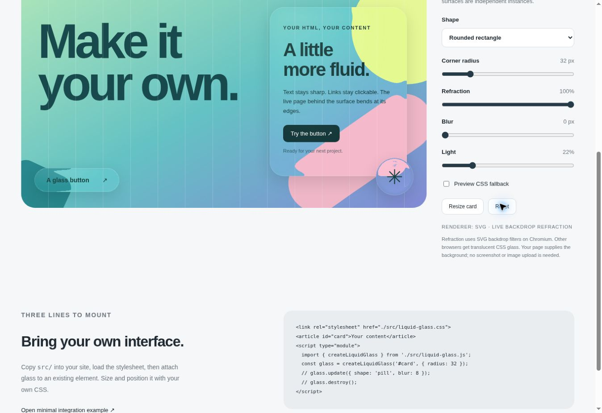

# Liquid Glass for Web

Reusable, Apple-inspired glass surfaces for **your own website**. Attach glass to an existing card, button, toolbar or navigation element. Put your own HTML inside it, size it with CSS, and change the shape and material through a small JavaScript API.

**No background image required.** The component filters the live page behind it: text, CSS gradients, images and other painted content. Foreground content stays sharp and interactive.

- Vanilla JavaScript, no runtime dependencies or build step.
- Multiple independent surfaces: rounded rectangles, capsules, circles and ellipses.
- Adjustable radius, refraction, blur and pointer-driven highlights.
- Automatic resize handling, lifecycle cleanup and TypeScript declarations.
- Plain HTML and React integration examples.
- SVG refraction on Chromium with a CSS glass fallback elsewhere.
- MIT licensed; no native Apple code or Apple assets.

Default material: **Refraction 100 / Blur 0 / Light 22**.



[Original WebGL wallpaper demo](https://liquidglass-astra.rennasfar.chatgpt.site) · [Minimal example](examples/minimal.html) · [React example](examples/react.jsx)

## Quick start: plain HTML

Copy the **whole `src/` folder** into your site. Serve the page over HTTP and load the stylesheet and module:

```html
<link rel="stylesheet" href="./src/liquid-glass.css">

<article id="my-card" style="width: 300px; padding: 32px;">
  <h2>Your content</h2>
  <p>Keep your existing HTML and event handlers.</p>
  <button type="button">A real button</button>
</article>

<script type="module">
  import { createLiquidGlass } from './src/liquid-glass.js';

  const glass = createLiquidGlass('#my-card', {
    radius: 32,
    refraction: 100,
    blur: 0,
    light: 22,
  });

  glass.update({ shape: 'pill', blur: 8 }); // Change it later
  // glass.destroy();                    // Before removing the element
</script>
```

Use a transparent container background so the glass is visible. The component does not move or wrap existing children, or set your text colors, typography, size, padding, semantics or events. Its decorative layers are `aria-hidden` and ignore pointer events. Set the host's own border radius separately if you want a matching focus outline or background border.

## Use with a bundler

Install directly from GitHub:

```sh
npm install github:kwlck/liquid-glass-web
```

```js
import { createLiquidGlass } from 'liquid-glass-web';
import 'liquid-glass-web/style.css';

const glass = createLiquidGlass(document.querySelector('.toolbar'), {
  shape: 'pill',
});
```

This release is distributed through GitHub; it is **not published to the npm registry**. No compilation or `prepare` script is required. The package includes the component and documentation, excluding demo photographs.

## Shapes and independent surfaces

Size and position each element with your own CSS. Every instance has its own options, SVG filter and resize observer.

```js
const card = createLiquidGlass('.card', { radius: 48 });
const button = createLiquidGlass('.cta', { shape: 'pill', light: 35 });
const circle = createLiquidGlass('.avatar-frame', { shape: 'ellipse' });
const oval = createLiquidGlass('.oval', { shape: 'ellipse', blur: 6 });

card.update({ radius: 8 });
button.update({ refraction: 60 });
```

```css
.card { width: 320px; padding: 32px; }
.cta { padding: 16px 28px; background: transparent; border: 0; }
.avatar-frame { width: 96px; height: 96px; }
.oval { width: 240px; height: 120px; }
```

`ellipse` becomes a circle when width and height are equal. `pill` uses half the shorter dimension as its radius. `rounded` accepts any nonnegative radius, clamped to fit. Arbitrary SVG paths, polygons, unequal corner radii and custom clip paths are not supported by the optical geometry in this release.

## API

### `createLiquidGlass(target, options?)`

`target` is a selector or an existing HTML container such as an `article`, `div`, `nav` or `button`. Mount after the element exists. Mounting the same element again returns and updates the existing instance.

| Option | Default | Meaning |
| --- | --- | --- |
| `refraction` | `100` | Edge bending, 0–100; SVG renderer only |
| `blur` | `0` | Blur amount, 0–40 CSS pixels |
| `light` | `22` | Highlight intensity, 0–100 |
| `radius` | `24` | Rounded-rectangle corner radius in CSS pixels |
| `shape` | `'rounded'` | `'rounded'`, `'pill'` or `'ellipse'` |
| `mode` | `'auto'` | `'auto'`, `'svg'` or `'css'` |
| `pointer` | `true` | Pointer highlight; disabled by reduced-motion preferences |
| `resolution` | `1` | Map pixels per CSS pixel, 0.25–2 |

Numeric ranges are clamped; invalid types and unknown shapes/modes throw.

```js
glass.update({ light: 45, radius: 16 }); // Partial update; returns instance
glass.refresh();                       // Rebuild geometry next frame
glass.renderer;                        // Chosen 'svg' or 'css' path
glass.options;                         // Read-only resolved options
glass.element;                         // Decorated HTML element
glass.destroy();                       // Release layers, filter, observers and listeners
```

Resizing is automatic with `ResizeObserver`. Call `refresh()` after layout changes in browsers without it. `destroy()` restores the inline properties and attributes the component changed and preserves original content. It is safe to call twice. A destroyed instance cannot be updated; mount the element again.

## React and other frameworks

[`examples/react.jsx`](examples/react.jsx) contains a small React wrapper. Mount in an effect after rendering, update when options change, and call `destroy()` during cleanup. The lifecycle supports development Strict Mode's mount/cleanup/remount cycle. Importing the core module during SSR is safe; mounting requires a browser DOM.

```jsx
<Glass options={{ radius: 32, blur: 0 }} style={{ width: 320, padding: 32 }}>
  <h2>Your component</h2>
  <button onClick={handleClick}>Continue</button>
</Glass>
```

Use the same mount/update/cleanup lifecycle in Vue, Svelte or other frameworks. Do not replace the host's complete `innerHTML` after mounting; mount again if your renderer removes the optical layers.

## Styling and integration

```css
.my-glass {
  --lg-tint: rgb(255 255 255 / .10);
  --lg-solid: #e7edf2; /* Reduced-transparency background */
  color: #173438;
}
```

The component adds `lg-host`, two child spans and an SVG definition. Its layers need a positioning/stacking context: a static target receives `position: relative`, and an automatic `z-index` becomes `0`. Explicit positioning/stacking is preserved. Mount on containers that accept children, not inputs, images or table structural elements. Avoid host borders that change the optical layer's size relative to the measured border box.

SVG definitions are placed in the same document or shadow root. If using a shadow root, load the component stylesheet inside it as well; test this integration in your target browser. This release's browser checks cover ordinary document containers.

## Browser support and limitations

The component applies an SVG displacement filter through CSS `backdrop-filter`. It samples the painted backdrop directly; it does **not** screenshot, clone or upload the page. Geometry maps regenerate on size/shape changes and are capped at 1024 pixels per dimension. Pointer highlights update during movement; there is no perpetual render loop.

`auto` conservatively selects SVG on desktop/Android Chromium (Chrome and Edge user-agent signatures) and CSS elsewhere. This is a heuristic, not proof of successful SVG rendering: `CSS.supports()` checks URL syntax rather than optical output. `glass.renderer` reports the chosen path. Use `mode: 'css'` for a browser/webview with faulty SVG rendering, or `mode: 'svg'` to explicitly test another browser.

- **Chromium:** live backdrop refraction, blur and highlights. Verified in the development Chrome browser.
- **Safari / Firefox / iOS:** automatic translucent CSS fallback; no promise of refractive parity. Not independently browser-tested in this release.
- Without `backdrop-filter`, tint and rim still appear; backdrop blur/refraction are unavailable.
- Ancestors with filters, opacity, masks or other backdrop roots can limit the sampled content. See [MDN's backdrop-filter description](https://developer.mozilla.org/en-US/docs/Web/CSS/Reference/Properties/backdrop-filter).
- Benchmark large panels and many simultaneous filters on your target devices.
- SVG mode uses locally generated `data:image/png` maps. A strict Content Security Policy must allow these in `img-src`, or use CSS mode. The core makes no network requests.
- Reduced-transparency preferences get an opaque surface. Choose readable foreground colors for either mode.

## Examples and development

```sh
git clone https://github.com/kwlck/liquid-glass-web.git
cd liquid-glass-web
npm run dev
```

Open **http://localhost:8080**. Development scripts require Node.js 20+, with no dependencies to install. Alternatively use `python3 -m http.server 8080` and a modern browser.

| Path | Contents |
| --- | --- |
| `/` | Card, navigation, button and circle showcase with material/shape controls |
| `/examples/minimal.html` | Copyable integration over a CSS gradient |
| `/tests/browser.html` | Lifecycle, multiple-instance, resizing and cleanup checks |
| `/demo/` | Original full-screen WebGL wallpaper experiment |

Run `npm run check` and `npm test`. On `/tests/browser.html`, press **Run integration checks**. See [CONTRIBUTING.md](CONTRIBUTING.md).

The original demo in `demo/` retains its English interface, local custom backgrounds and **100 / 0 / 22** defaults. Its WebGL renderer samples a wallpaper texture and includes chromatic dispersion. The reusable component is a separate live-DOM SVG/CSS renderer for real website content; it does not promise identical optical output to that demo or Apple's native engine.

## License

Original code, styles and documentation: [MIT](LICENSE). Demo photographs: [Unsplash License](https://unsplash.com/license), excluded from the MIT grant; see [ASSETS.md](ASSETS.md). The reusable component contains no third-party photographs.

Independent experiment inspired by Apple's Liquid Glass. Not affiliated with Apple; this is not Apple's native material engine.
